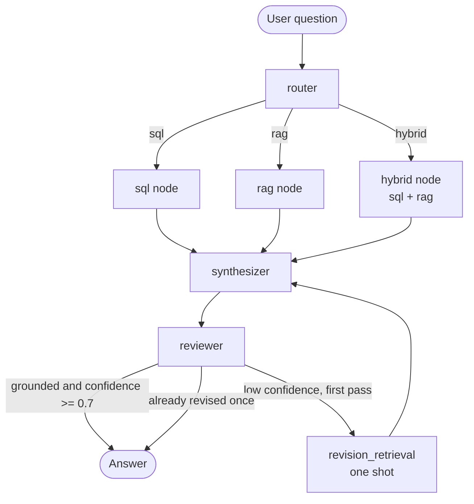
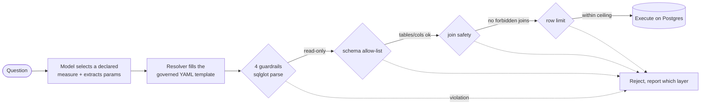
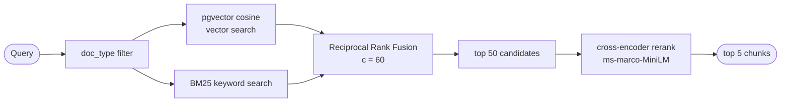

# SemaFlow Architecture

Governed multi-agent analytics where the language model never writes the SQL.

This document is the engineering reference for SemaFlow: the architecture, the design
decisions, the failures that drove them, and the roadmap. It doubles as a product
requirements view (see [PRD view](#11-prd-view)) and a roadmap (see
[Roadmap](#12-roadmap-phases-and-milestones)).

- **Repository:** https://github.com/VinayKale1998/semaflow
- **Status:** Stages 1 to 5 complete. Stage 6 (evaluation harness) is next.
- **Last updated:** 2026-06-14
- **Scope note:** Portfolio project on the public Olist dataset, not a production system.
  Positioning and resume material live in a separate document, not here.

---

## Contents

1. [Overview](#1-overview)
2. [System architecture](#2-system-architecture)
3. [The trust boundary](#3-the-trust-boundary)
4. [Semantic layer](#4-semantic-layer)
5. [Retrieval pipeline](#5-retrieval-pipeline)
6. [The reviewer and confidence gate](#6-the-reviewer-and-confidence-gate)
7. [Design decisions and failure-driven changes](#7-design-decisions-and-failure-driven-changes)
8. [Lessons learned](#8-lessons-learned)
9. [Scope discipline](#9-scope-discipline)
10. [Tech stack](#10-tech-stack)
11. [PRD view](#11-prd-view)
12. [Roadmap, phases, and milestones](#12-roadmap-phases-and-milestones)
13. [Repository map](#13-repository-map)
14. [Conventions and constraints](#14-conventions-and-constraints)

---

## 1. Overview

SemaFlow turns plain business questions into trusted answers over a real e-commerce data
warehouse (Brazilian Olist, with genuine joins and genuine data quality problems). The
defining idea is a trust boundary. The language model is not allowed to write SQL. It is
demoted from author to selector: it picks from a declared set of approved measures and
extracts parameters, and deterministic code assembles and validates the query before it
runs.

The result is a system where the model can be wrong without being dangerous. A question
that needs prose rather than numbers routes to a governed document corpus instead, and a
question that needs both gets a synthesized hybrid answer. Every answer is reviewed for
groundedness before it is shown, and the whole flow is traced end to end.

---

## 2. System architecture

The system is a LangGraph state machine. A router classifies the question, one or both
data paths run, a synthesizer writes the answer, and a reviewer decides whether to ship
it or reformulate once.



| Node | File | Responsibility |
|---|---|---|
| `router` | `app/orchestrator/router.py` | Classify the question as `sql`, `rag`, or `hybrid`. Claude Haiku via forced tool use. |
| `sql` | `app/sql/pipeline.py` | Run the text-to-SQL pipeline (select measure, resolve, guardrail, execute). |
| `rag` | `app/rag/retriever.py` | Hybrid retrieval over the document corpus. |
| `hybrid` | `app/orchestrator/graph.py` | Run the SQL path then the RAG path, merge both results. |
| `synthesizer` | `app/orchestrator/synthesizer.py` | Write one grounded answer from whatever the paths produced. Claude Sonnet. |
| `reviewer` | `app/orchestrator/reviewer.py` | Judge grounded and confident separately. Claude Haiku via forced tool use. |
| `revision_retrieval` | `app/orchestrator/graph.py` | One-shot reformulated retrieval pass on low confidence. |

The orchestrator is wired in `app/orchestrator/graph.py`. The router, retriever,
synthesizer, and reviewer are instantiated once at init (they are heavy: Anthropic
clients plus two transformer models and a BM25 index), and the graph is compiled once.

### State

The graph carries a single `OrchestratorState` dict (`graph.py`):

| Field | Meaning |
|---|---|
| `query` | The user question. |
| `route`, `route_reason`, `route_confidence` | Router output. The route is set once and locked. |
| `sql_result` | `PipelineResult` dump, or `None` on unexpected failure. |
| `rag_chunks` | List of retrieved chunk dumps, or `None`. |
| `synthesis` | Synthesizer output (answer, sources used). |
| `confidence`, `grounded`, `review_reasoning` | Reviewer verdict. |
| `revised_query` | Reformulated retrieval string for the revision pass. |
| `revision_count` | 0 on the first pass, hard capped at 1. |
| `errors` | Unexpected node exceptions only. Normal failures are reported as status, not errors. |

---

## 3. The trust boundary

This is the core of the project. Most text-to-SQL systems let the model emit SQL and
hope it is correct. A model writing raw SQL can invent columns or tables, leak data
across tables through unsafe joins, run a query nobody authorized, or hallucinate an
answer when the query fails. SemaFlow removes those failure modes by construction.



The mechanism, step by step:

1. **The model selects, it does not author.** Given the question, the model picks the
   right measure from the semantic layer and extracts parameters (a category, a state, a
   time window). It never produces SQL text. Code in `app/sql/node.py`.
2. **The resolver assembles deterministically.** `app/sql/resolver.py` fills the chosen
   YAML template with the extracted parameters using safe substitution. No f-strings,
   no model output in the query string.
3. **Four guardrail layers validate before execution.** `app/sql/guardrails.py` parses
   the assembled SQL with sqlglot and runs four independent checks:

   | Guardrail | Blocks |
   |---|---|
   | Read-only | Any write, update, delete, or DDL |
   | Schema allow-list | Tables or columns outside the approved set |
   | Join safety | Joins not declared safe in the semantic layer |
   | Row limit | Result sets above a hard ceiling |

   The checks do not short-circuit. All four always run, so the result carries per-layer
   booleans (`is_read_only`, `schema_valid`, `joins_safe`, `row_limit_enforced`) plus a
   flat list of violations. A failure tells you exactly which rule broke.
4. **Only a clean query executes.** `app/sql/executor.py` runs the validated SQL via
   SQLAlchemy and returns rows, columns, and a row count.

The worked example is the revenue fan-out. Joining `fact_order_items` to
`fact_order_payments` looks harmless but payments has multiple rows per order
(installments and split payments), so the join fans out and inflates revenue. That join
is declared `safe: false` in the semantic layer, and the join-safety guardrail is the
layer that rejects it. See [section 7](#7-design-decisions-and-failure-driven-changes).

---

## 4. Semantic layer

The semantic layer (`app/semantic/semantic_layer.yaml`) is the single source of truth.
Code reasons against this config, not against the raw database schema. It declares:

- **Terms** the business definitions: `revenue` (item-grain gross merchandise value),
  `aov` (average order value), `seller_rating`, `return_rate` (canceled or unavailable
  orders, since Olist has no post-delivery return tracking).
- **Measures** the four governed, parameterized SQL templates:
  `top_categories_by_revenue`, `aov_by_state`, `seller_ratings_by_state`,
  `return_rate_by_category`. Each carries its template and its allowed parameters.
- **Allowed joins** an explicit list of which table-to-table joins are safe, including
  the one forbidden join (items to payments) that the guardrail must reject.
- **Glossary** the vocabulary the model resolves against:
  - `time_periods` resolved against `dataset_reference_date = 2018-10-17`, not
    `CURRENT_DATE`, because the dataset is frozen (Sep 2016 to Oct 2018). In production
    this constant becomes `now()`.
  - `regions` named groupings of Brazilian states (south, southeast, north).
  - `fuzzy_terms` defaults for vague words (top means 10, underperforming means below
    median, high means top quartile).

**Scope discipline:** an entry exists only if a golden-set question needs it. The
project deliberately does not model every column. Adding measures or glossary terms
without a question that requires them is out of bounds.

---

## 5. Retrieval pipeline

The RAG path answers questions that need prose: what a column means, what a policy says,
what a category contains. It runs over a governed corpus of 24 authored markdown
documents (data dictionary, policy, category definitions), chunked into 147 chunks.



- **Storage:** a `doc_chunks` table in Postgres next to the star schema. Columns: `id`
  (uuid), `content`, `source`, `doc_type`, `chunk_index`, `embedding` (vector(384)). An
  HNSW index on the embedding column for approximate nearest neighbor, a B-tree on
  `doc_type` for the metadata filter.
- **Embeddings:** sentence-transformers all-MiniLM-L6-v2, 384 dimensions, run locally,
  no API cost.
- **Hybrid search:** pgvector cosine similarity and BM25 keyword search, merged with
  Reciprocal Rank Fusion (c = 60), then reranked from the top 50 to the top 5 with a
  cross-encoder.
- **Interface:** `Retriever.retrieve(query, top_k, doc_type) -> list[Chunk]` in
  `app/rag/retriever.py`. The BM25 corpus and both models load once at init.
- **Chunking:** fixed size, 256 tokens with 32 overlap, markdown-header aware. The
  original spec said 512/64; the implementation settled smaller because the Olist docs
  are short. See `app/corpus/chunk.py`.

There is a visual, step-by-step walkthrough of this pipeline in
`app/rag/walkthrough/` (open `index.html` in a browser).

---

## 6. The reviewer and confidence gate

Before any answer is shown, the reviewer (`app/orchestrator/reviewer.py`) makes two
separate judgments:

- **Grounded:** does every claim trace back to a real SQL row or a retrieved document?
  An honest "the sources do not cover this" is grounded, because it tells no lies.
- **Confident (0 to 1):** does the answer actually resolve the question that was asked?

These come apart on purpose. A fluent hedge can be perfectly grounded and still useless,
so a grounded hedge scores low confidence and must propose a `revised_query`.

The confidence gate lives in `_route_after_review` in `graph.py`. An answer is approved
only when it is grounded and confidence is at least `CONFIDENCE_THRESHOLD = 0.7`.
Otherwise the graph loops back once through `revision_retrieval`, which re-runs the
retriever with the reformulated query, then re-synthesizes and re-reviews.

**The loop is one-shot and the route is locked.** The router decides the route once, on
the first pass. A low-confidence retry does not call the router again. For rag and hybrid
questions the retry re-runs the retriever only with the revised query; for sql questions
nothing re-runs (SQL is deterministic from declared measures, not free text), so the
synthesizer simply tries again with the same rows. The `revision_count` hard cap at 1
means the cycle cannot spin: after one revision the graph always ends with whatever it
has.

**Known limitation:** because the route is locked, a wrong first-pass route cannot be
corrected by the retry. It just re-searches the wrong source. This is a deliberate v1
tradeoff and a candidate for router stress-testing in Stage 6.

The demonstrated agentic behavior on this corpus is fire, reformulate, then hedge
honestly. First-pass hybrid retrieval is strong enough that genuine fire-and-recover
cases are rare, and no artificial recover case was engineered (no lowered top_k, no
contrived sparse queries). That is the honest framing.

---

## 7. Design decisions and failure-driven changes

The governing principle: every component must trace to a specific observed failure on
this corpus. "It is a good technique" is not sufficient justification. The decisions
below each came from a real failure.

| Observed failure | Decision |
|---|---|
| Joining items to payments inflated revenue from 13.59M to 14.21M (about 4.5%) through fan-out on installment rows. | Declared the items-to-payments join `safe: false`; the join-safety guardrail rejects it. Revenue is computed at item grain only. |
| BM25 split identifiers like `order_status` and `customer_unique_id` on the underscore, destroying recall for schema-term queries. | Tokenizer keeps underscores (`[^a-z0-9_\s]`) so identifiers survive as single tokens. |
| Boilerplate section titles ("What it does NOT cover") matched query words like what and does, flooding BM25 with irrelevant chunks. | Tokenizer strips a stopword set. A real corpus failure, not generic hygiene. |
| BM25 length normalization buried the long column-definition chunk so it never ranked top-3 alone. | Accepted by design. BM25 is candidate recall into the top-50 pool; RRF and the cross-encoder do final ranking. The `b` parameter is deliberately not tuned to mask this. |
| Single-review sellers dominated "lowest rated sellers" results. | `HAVING COUNT(reviews) >= 5` in the seller-ratings measure. A metric-governance decision baked into the template. |
| Honest hedges scored 0.85 and never tripped the confidence gate, so the loop never fired. | Recalibrated the reviewer rubric: any "the sources do not cover this" non-answer scores below 0.7 regardless of fluency. The damaged-items question now fires reliably (3/3), and resolving cases stayed high (0.92 to 0.95). |
| The crypto-payments question fired the loop but recovered unstably (reformulation pulled the payment-types chunk, 2/3 runs scored above the gate). | Rejected crypto as the hedge demo; locked the damaged-items question instead, which hedges consistently. |
| A 5-category "explain each" hybrid question diluted retrieval against top_k=5 and reliably fired the revision loop. | Changed the Stage 5 checkpoint question to a single-concept hybrid question that resolves first-pass. Logged the dilution as a Stage 6 top_k stress-test candidate. |
| Relative time terms ("last quarter") are meaningless against a frozen 2016 to 2018 dataset if resolved to today. | All relative time resolves against `dataset_reference_date = 2018-10-17`. |

---

## 8. Lessons learned

1. **Data quality problems matter more than model quality.** A naive order-items to
   payments join inflated revenue by about 4.5% (13.59M true versus 14.21M fanned out on
   Olist). The semantic layer exists because correctness failures often originate in data
   modeling, not in model inference.
2. **Grounded and confident are not the same thing.** An answer can be fully grounded and
   still fail to resolve the question. The reviewer evaluates the two separately, so an
   honest hedge scores low confidence without being marked a lie.
3. **Semantic governance beats prompt engineering.** Business definitions such as return
   rate, average order value, and seller performance needed governed measures, with rules
   like the 5-review minimum baked into the template, rather than increasingly elaborate
   prompts.
4. **Observability changes system design.** LangSmith traces surfaced failure modes that
   were invisible from the outputs alone, which drove changes to routing and reviewer
   behavior, including the confidence-gate recalibration.
5. **Every component should justify its existence.** Semantic chunking, HyDE, and
   multi-hop retrieval were evaluated and deliberately excluded because the observed
   failure modes on this corpus did not justify the added complexity.

---

## 9. Scope discipline

Several popular techniques were considered and deliberately left out, because they solve
problems this corpus does not have. Documenting the exclusions is part of the design.

| Excluded | Reason |
|---|---|
| Semantic chunking with a model | The documents are short, deliberately structured, and authored under control. Fixed-size chunking already works. |
| Query rewriting / HyDE | The real retrieval failure was category tokens blurring together, which hybrid search fixes directly. |
| PDF parsing | Olist has no real policy PDFs. Adding a format dependency is engineering for the resume, not the corpus. |
| Agentic / multi-hop retrieval | Out of scope for the retrieval layer; the orchestrator handles single-shot reformulation. |
| Pinecone or alternate vector stores | pgvector is sufficient. The interface stays swappable but is not swapped. |

The principle behind all of these: a component without a failure story weakens both the
build and the explanation of it.

---

## 10. Tech stack

| Layer | Choice |
|---|---|
| Language | Python 3.14 |
| Data warehouse + vector store | Postgres 16 with pgvector (Docker) |
| Dataset | Brazilian Olist e-commerce |
| Text-to-SQL model | Claude Haiku (selector role only) |
| Synthesizer | Claude Sonnet |
| Router and reviewer | Claude Haiku (forced tool use) |
| Orchestration | LangGraph |
| Tracing | LangSmith |
| SQL parsing | sqlglot |
| Embeddings | sentence-transformers all-MiniLM-L6-v2 (384d, local) |
| Keyword search | rank_bm25 |
| Reranking | cross-encoder ms-marco-MiniLM |
| Data contracts | Pydantic |
| Config | PyYAML (the semantic layer) |
| UI | Streamlit |

**Model note:** Gemini Flash is the intended text-to-SQL workhorse. It is temporarily
swapped for Claude Haiku because the Gemini free tier has a zero quota in India. The
interface is identical; re-enabling Gemini is a single-file change in `app/sql/node.py`
once GCP billing is on.

---

## 11. PRD view

This section is the product requirements subset of the document.

**Problem.** Ask a normal AI tool a data question and it writes SQL and hopes it is
right. That is the part no serious business can deploy. A model writing raw SQL can
invent columns, leak data across tables, run an unauthorized query, or hallucinate the
answer outright. Reviewing the SQL after the fact does not remove the risk.

**Users.** The analyst or operator who asks a question in plain language, and the
business that has to trust the output enough to act on it.

**Goals.**
- Answer business questions over a real warehouse without the model authoring SQL.
- Make wrong answers safe (no destructive, unauthorized, or fan-out queries).
- Separate "is this true" from "does this answer the question," and behave honestly when
  the data does not cover the question.
- Surface the evidence (route, SQL, chunks, reviewer verdict) as first-class output, not
  just the prose.

**Non-goals.**
- Production hardening, auth, multi-tenancy, or scale.
- Letting the model write arbitrary SQL under any circumstances.
- Feature breadth for its own sake (see [scope discipline](#9-scope-discipline)).

**Functional requirements.**
- Route a question to sql, rag, or hybrid.
- Govern SQL: select a declared measure, resolve a template, validate with four
  guardrails, execute.
- Retrieve from a governed corpus with hybrid search and reranking.
- Synthesize one grounded answer from the available evidence.
- Review for groundedness and confidence; reformulate once or hedge honestly.
- Expose route, confidence, grounding, self-correction, the SQL, and the chunks in the
  UI, with full tracing underneath.

**Success criteria.** The governance holds and is measurable: the model stays a selector,
guardrails reject what they should, retrieval surfaces the right sources, and the
reviewer hedges on uncovered questions. Stage 6 turns these into measured metrics.

---

## 12. Roadmap, phases, and milestones

| Stage | Scope | Status | Key artifact |
|---|---|---|---|
| 1 | Data model | Complete | Star schema, 9 tables loaded with FKs |
| 2 | Semantic layer | Complete | `semantic_layer.yaml` validated |
| 3 | Text-to-SQL + guardrails | Complete | `app/sql/` pipeline, 4-layer guardrails |
| 4 | Hybrid RAG | Complete | `doc_chunks` table, `Retriever`, 147 chunks |
| 5 | LangGraph orchestration + reviewer + UI | Complete | Router, graph, synthesizer, reviewer, Streamlit trust UI |
| 6 | Evaluation harness | Next | `evals/` scorecard over the golden set |

**Stage 6 plan.** Expand `app/semantic/golden_set.yaml` from the current handful to 30 to
50 questions across sql, rag, and hybrid plus the hedge cases, each tagged with expected
route, measure, source docs, and behavior. Build an `evals/` harness that runs every
question through `Orchestrator.run` and scores the governance, not answer fluency:

- Routing accuracy (did the router classify correctly).
- Measure-selection accuracy (did the SQL path pick the declared measure).
- Guardrail behavior (injected bad SQL rejected at the right layer; seeded by
  `app/sql/tests/test_guardrails.py`).
- Retrieval hit-rate at k (expected source in the top k).
- Reviewer calibration (honest-hedge precision and recall; seeded by
  `scripts/probes/hedge_reliability.py`).

Output is a re-runnable markdown scorecard, so the trust claims become CI-testable
rather than asserted.

---

## 13. Repository map

```
app/
  semantic/      semantic_layer.yaml + golden_set.yaml (governed source of truth)
  sql/           text-to-SQL: models, prompts, node, resolver, guardrails, executor, pipeline
  orchestrator/  LangGraph: router, graph, synthesizer, reviewer
  corpus/        document authoring, chunking, embedding scripts
  rag/           retrieval interface + visual pipeline walkthrough
  llm/           LLM client wrappers + LangSmith tracing
  ui/            Streamlit trust UI
db/              schema and migration scripts (add_doc_chunks.py)
data/            raw Olist CSVs (downloaded via app/download_olist.py, not committed)
evals/           golden-set evaluation harness (Stage 6, planned)
scripts/probes/  diagnostic scripts (not tests): hedge_reliability.py, loop_probe.py
```

---

## 14. Conventions and constraints

- Type hints on all functions. Pydantic models for all data contracts between stages.
- Logging via the stdlib `logging` module, not print statements.
- Load `.env` with python-dotenv at every entry point. No hardcoded paths or credentials.
- Never use f-strings for SQL template substitution. Use the resolver's safe substitution.
- Always use `python -m pip`, never bare `pip` (system pip conflict on the dev distro).
- Tests live in `app/<module>/tests/` using pytest. Run scoped to `app/` (a bare `pytest`
  tries to scan the root-owned Docker data volume and errors). Suite is 37 tests, green.
- Voice rule: no em dashes anywhere. Plain, direct English.
- The 121MB of public Olist CSVs are untracked (fetched by `app/download_olist.py`) but
  still present in git history. Shrinking the clone would need a history rewrite.

---

*Engineering documentation. Positioning and resume material are maintained separately.*
